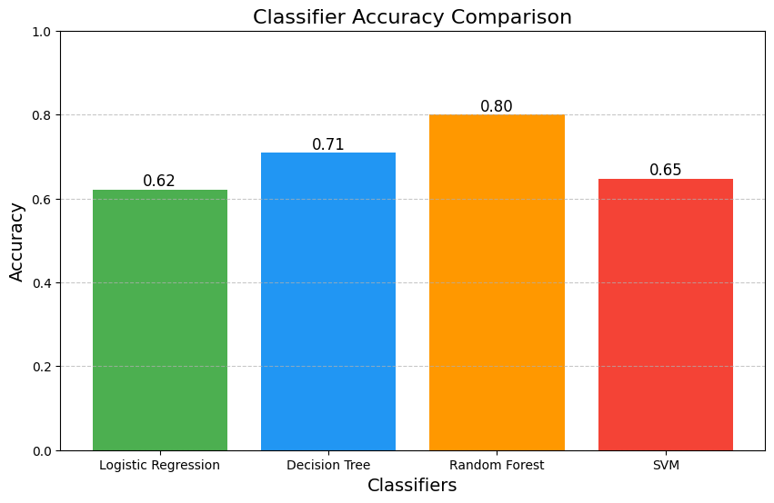

# Intelligent Credit Score Classifier

## Problem Statement

Over the years, the company has collected basic banking details and a wealth of credit-related information. The management aims to develop an intelligent system that can classify individuals into credit score brackets, thereby reducing manual efforts. The objective is to build a machine learning model that can accurately classify a person's credit score based on their credit-related information.


## Dataset Information

The credit score dataset consists of 100,000 records and 28 features, including:

- **ID**
- **Customer_ID**
- **Month**
- **Name**
- **Age**
- **SSN**
- **Occupation**
- **Annual Income**
- **Monthly In-hand Salary**
- **Number of Bank Accounts**
- **Number of Credit Cards**
- **Interest Rate**
- **Number of Loans**
- **Type of Loan**
- **Delay from Due Date**
- **Number of Delayed Payments**
- **Changed Credit Limit**
- **Number of Credit Inquiries**
- **Credit Mix**
- **Outstanding Debt**
- **Credit Utilization Ratio**
- **Credit History Age**
- **Payment of Minimum Amount**
- **Total EMI per Month**
- **Amount Invested Monthly**
- **Payment Behavior**
- **Monthly Balance**
- **Credit Score**

## Installation

To run this project, you will need to install the necessary dependencies. You can do so by using the following command:

```bash
pip install -r requirements.txt
```

## Methodology

The following steps were performed in the data preprocessing and modeling phases:

1. **Data Cleaning**: Addressed missing values and corrected inconsistencies in the dataset.
2. **One-Hot Encoding**: Converted categorical variables into a format suitable for machine learning.
3. **Standard Scaling**: Normalized feature values to ensure a standard scale.
4. **Feature Selection**: Evaluated multicollinearity to select significant features and remove redundant ones.
5. **Outlier Removal**: Identified and eliminated outliers to improve model performance.

## Classification Techniques

Several classification algorithms were implemented to classify the credit scores:

- **Logistic Regression**
- **Decision Tree Classification**
- **Random Forest Classification**
- **Support Vector Machine (SVM) Classification**

## Results

The performance of each classification model was evaluated, with the following accuracies obtained:

- **Credit Score Classifier Accuracy**: 0.62
- **Decision Tree Classifier Accuracy**: 0.71
- **Random Forest Classifier Accuracy**: 0.80
- **SVM Classifier Accuracy**: 0.65




### The Random Forest classifier yielded the best results, achieving an accuracy of **80%**.

## Conclusion

The Intelligent Credit Score Classifier effectively classifies individuals into credit score brackets, significantly reducing manual intervention. The Random Forest model demonstrated superior accuracy, making it the preferred choice for implementation.

